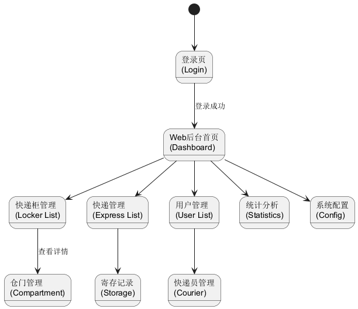

# 用户界面设计

## 1. 用户界面设计概述
根据“快递柜综合应用系统”的用例描述及业务流程，本系统界面设计分为移动端App（Uni-app）、Web管理后台（Vue）及硬件模拟终端（Swing/JavaFX）三大部分。

### 1.1 移动端App界面概览
- **首页 (HomeUI)**：App默认加载页面，区分用户端与快递员端视图，提供核心功能入口（扫码、取件、投递）。
- **登录页 (LoginUI)**：提供用户/快递员身份切换登录功能。
- **注册页 (RegisterUI)**：收集用户/快递员注册信息并进行验证。
- **服务页 (ServiceUI)**：提供增值服务入口，如寄件、寄存历史查询。
- **个人中心页 (UserUI)**：显示用户信息、订单记录及设置入口。
- **投递流程页 (DepositUI)**：快递员扫码后的操作页面，包含格口选择与单号录入。
- **取件页 (PickupUI)**：用户输入取件码或扫码后的确认页面。
- **寄件页 (SendUI)**：在线填写寄件信息的表单页面。
- **寄存页 (StoreUI)**：物品寄存选择格口与支付页面。

### 1.2 界面跳转关系
下图展示了移动端App各界面之间的跳转逻辑：

## 2. 用户界面原型

### 2.1 登录/注册页 (LoginUI / RegisterUI)
**功能描述**：作为系统的入口，负责用户身份认证。
- **交互内容**：
    - **身份切换**：顶部Tab切换“我是用户”/“我是快递员”。
    - **输入信息**：手机号、密码/验证码。
    - **登录操作**：点击“登录”按钮请求后端验证，失败显示红色错误提示。
    - **前往注册**：点击“注册账号”跳转至注册页。
    - **注册流程**：填写手机号、验证码、设置密码、同意协议，点击“注册”完成并自动登录。

### 2.2 快递员-首页 (HomeUI - Courier)
**功能描述**：快递员工作台，聚焦投递任务。
- **交互内容**：
    - **顶部导航**：显示当前快递柜位置（定位）。
    - **核心操作**：巨大的“扫一扫”按钮，用于扫描柜体二维码。
    - **数据看板**：显示今日投递量、本柜剩余空格数（大/中/小）。
    - **任务列表**：展示待处理的揽件任务或超时件提醒。

### 2.3 快递员-投递流程页 (DepositUI)
**功能描述**：完成快件入柜操作。
- **交互内容**：
    - **格口选择**：展示当前柜体可用格口（S/M/L），点击选择。
    - **信息录入**：支持扫描快递单条形码或手动输入单号。
    - **手机号补录**：输入收件人手机号（部分场景需手动）。
    - **开门确认**：点击“确认投递”，柜门弹开，放入物品后点击“已关门”。

### 2.4 用户-首页 (HomeUI - User)
**功能描述**：普通用户的核心服务入口。
- **交互内容**：
    - **取件入口**：
        - **扫码取件**：调用摄像头扫描柜体二维码。
        - **口令取件**：中央输入框输入6位取件码。
    - **功能导航**：宫格菜单显示“我要寄件”、“物品寄存”、“我的包裹”、“帮助中心”。
    - **待取包裹卡片**：若有待取件，首页顶部展示卡片（含取件码、超时倒计时）。

### 2.5 寄件页 (SendUI)
**功能描述**：用户在线下单寄件。
- **交互内容**：
    - **地址填写**：寄件人/收件人信息录入（支持地址簿导入）。
    - **物品信息**：选择物品类型、重量预估。
    - **下单支付**：显示预估运费，点击“下单”生成寄件码。

### 2.6 硬件模拟终端界面
**功能描述**：模拟柜体屏幕交互。
- **待机广告页**：全屏轮播图，点击屏幕任意位置进入主菜单。
- **主菜单页**：
    - **我是用户**：点击进入取件码输入页。
    - **我是快递员**：点击显示柜体二维码供App扫描。
- **开门提示页**：显示柜体平面图，高亮弹开的格口，并倒计时提示关门。

### 2.7 Web管理后台设计
**功能描述**：管理员进行全局监控与运维。
- **仪表盘 (Dashboard)**：设备在线率、今日订单量趋势图、实时告警。
- **快递柜管理**：列表展示所有柜体，点击详情查看格口实时状态矩阵；支持远程开门。
- **快递业务管理**：查询所有投递、寄件、寄存订单详情；查看寄存历史记录。
- **用户管理**：管理普通用户和快递员信息，审核快递员资质。
- **统计分析**：
    - **电量统计**：查看各快递柜日用电量柱状图。
    - **市场分析**：查看各快递公司投递占比饼图。
    - **趋势分析**：月度快递量折线图。
    - **资源监控**：各尺寸仓门使用率统计。
- **系统配置**：
    - **基础设置**：修改系统名称。
    - **业务规则**：设置取件超时时间（默认24h）、寄存超时时间（默认12h）。
    - **开关控制**：开启/关闭短信通知、超时提醒、人脸识别功能。

## 3. 交互与反馈设计
- **加载反馈**：所有异步请求显示Loading动画。
- **操作反馈**：
    - 成功：显示绿色对勾Toast（如“投递成功”）。
    - 失败：显示红色感叹号Toast及原因（如“验证码错误”）。
- **异常处理**：网络断开时显示“网络连接异常”缺省页。
