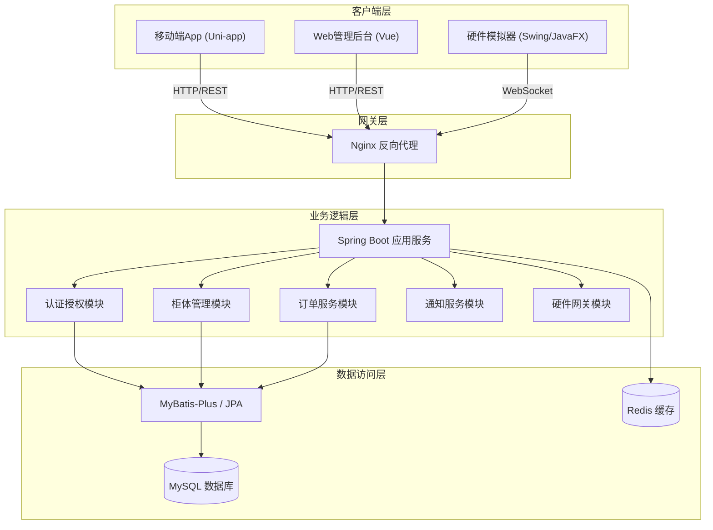
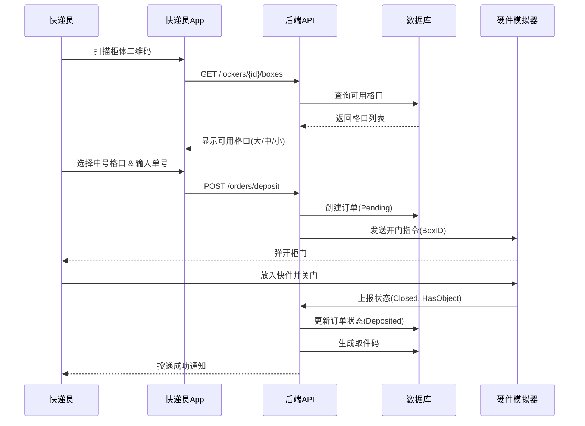
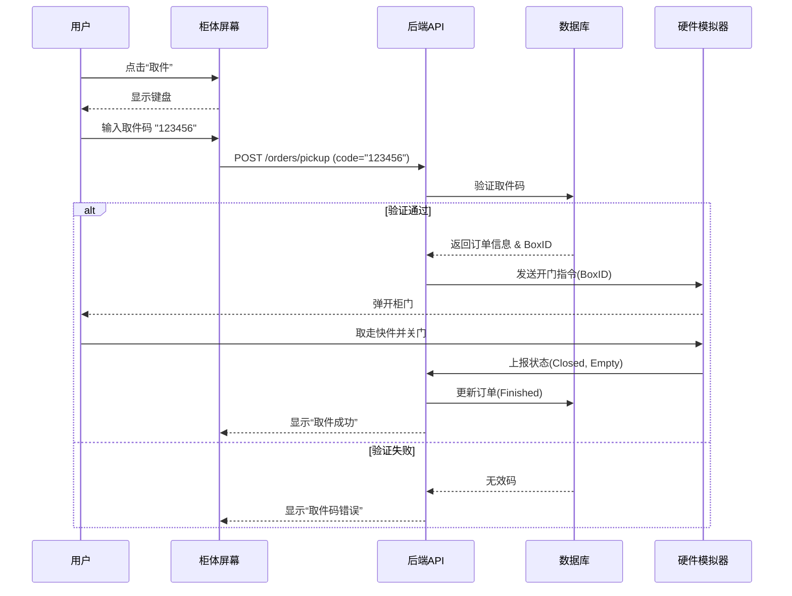
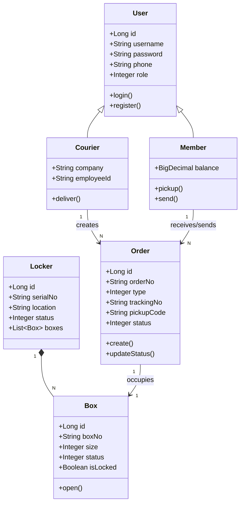
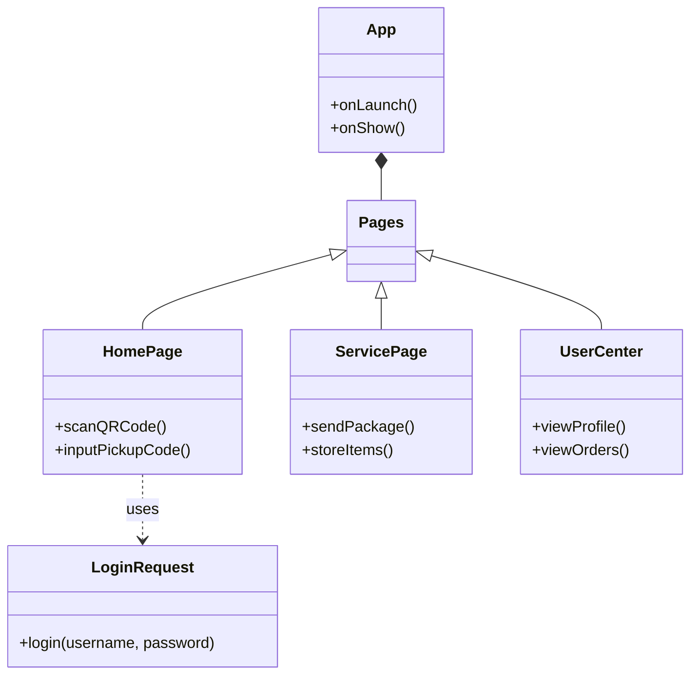
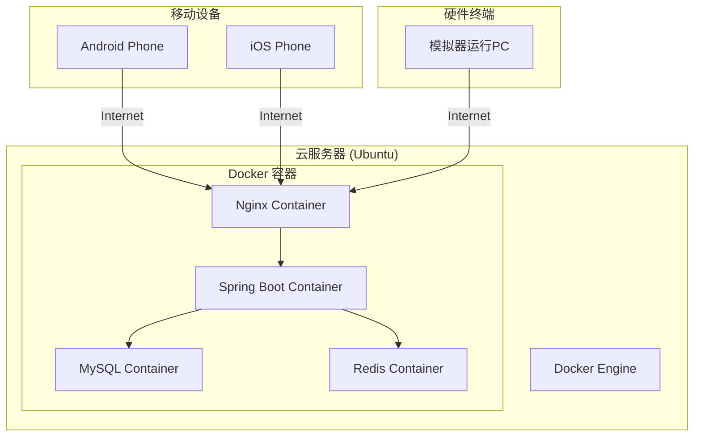

# 软件设计规格说明书

## 1. 引言

### 1.1 编写目的
本文档详细描述了“快递柜综合应用系统”的软件体系结构、模块设计及接口定义，指导开发人员进行编码实现。

### 1.2 读者对象
软件系统用户、软件设计工程师、程序员、软件测试工程师、软件质量保证人员等。

### 1.3 软件项目概述
- **项目名称**: 快递柜综合应用系统 (CASExpressLockers)
- **开发单位**: 重庆大学软件工程课程设计小组
- **项目背景**: 随着电商物流的高速发展，为了解决“最后100米”配送难题，智能快递柜成为物流末端的重要基础设施。本项目旨在设计并实现一套包含硬件模拟、移动端应用及Web管理后台的综合系统。

### 1.4 文档概述
本文档包括以下的章节内容：
- **引言部分**：描述软件项目的概要信息。
- **软件设计约束部分**：描述软件设计目标和原则、软件设计的约束和限制。
- **软件设计部分**：描述软件体系结构设计、用户界面设计、用例设计、类设计、数据设计以及部署设计等的具体内容。

### 1.5 参考资料
1. 《快递柜综合应用系统》需求说明书
2. 《软件工程：理论与实践》

## 2. 软件设计约束

### 2.1 软件设计目标和原则
本系统的设计目标是构建一个高可用、可扩展、易维护的快递柜综合应用系统。设计原则包括：
- **模块化与高内聚低耦合**：将系统划分为独立的模块，各模块内部职责单一，模块间依赖最小化。
- **分层架构**：采用表现层、业务逻辑层、数据访问层的经典分层架构。
- **安全性**：确保用户数据和通信过程的安全。
- **可扩展性**：支持未来功能的扩展，如接入真实硬件、增加人脸识别等。

### 2.2 软件设计的约束和限制
- **硬件要求**：
    - 前端App：Android 5.0及以上，iOS 10.0及以上。
    - 后端服务器：2核4G内存以上，带宽5Mbps以上。
- **软件要求**：
    - 操作系统：Linux (Ubuntu/CentOS) 或 Windows Server。
    - 数据库：MySQL 8.0。
    - 运行环境：JDK 17+, Node.js 16+。

### 2.3 技术选型

| 组件 | 技术栈 | 说明 |
| :--- | :--- | :--- |
| **后端框架** | Java Spring Boot 3.x | 核心业务逻辑，提供RESTful API |
| **前端框架** | Vue 3 + Element Plus | Web管理后台 |
| **移动端** | Uni-app (Vue) | 跨平台App开发 (Android/iOS/H5) |
| **数据库** | MySQL 8.0 | 关系型数据存储 |
| **ORM**      | MyBatis-Plus / JPA        | 数据持久层框架                 |
| **通信协议** | HTTP (RESTful), WebSocket | 前后端交互，实时状态推送       |

## 3. 软件设计

### 3.1 软件体系结构设计
系统采用分层架构（Layered Architecture）和前后端分离模式。

#### 3.1.1 总体架构图

#### 3.1.2 模块划分
1.  **用户中心模块 (User Center)**：处理注册、登录、实名认证、个人信息管理。
2.  **柜体管理模块 (Locker Manager)**：管理柜体信息、格口状态（空闲/占用/故障）、远程控制。
3.  **订单服务模块 (Order Service)**：处理投递、取件、寄件、寄存订单的生命周期。
4.  **硬件网关模块 (Hardware Gateway)**：与硬件模拟器保持心跳连接，下发开锁指令，接收传感器状态。
5.  **通知模块 (Notification)**：发送取件码短信（模拟）。

### 3.2 用户界面设计
根据“快递柜综合应用系统”的用例描述，系统包含移动端App界面、Web管理后台界面和硬件模拟终端界面。详情请查看《用户界面设计》文档。

### 3.3 用例设计 (顺序图)

#### 3.3.1 快递员投递时序图

#### 3.3.2 用户取件时序图

### 3.4 类设计

#### 3.4.1 后端业务处理子系统类图

#### 3.4.2 前端App子系统类图 (Vue/Uni-app组件)

### 3.5 数据设计
本系统使用MySQL数据库存储业务数据。

#### 3.5.1 用户表 (sys_user)
存储系统所有用户的基本信息。
| 字段名 | 类型 | 长度 | 必填 | 说明 |
| :--- | :--- | :--- | :--- | :--- |
| id | BIGINT | 20 | Y | 主键，自增 |
| username | VARCHAR | 50 | Y | 用户名/账号 |
| password | VARCHAR | 100 | Y | 加密密码 |
| phone | VARCHAR | 20 | Y | 手机号 |
| role | TINYINT | 1 | Y | 角色：0-管理员，1-用户，2-快递员 |
| create_time | DATETIME | - | Y | 创建时间 |

#### 3.5.2 快递员信息表 (sys_courier)
快递员扩展信息。
| 字段名 | 类型 | 长度 | 必填 | 说明 |
| :--- | :--- | :--- | :--- | :--- |
| id | BIGINT | 20 | Y | 主键 |
| user_id | BIGINT | 20 | Y | 关联sys_user.id |
| company | VARCHAR | 50 | Y | 所属快递公司 |
| employee_id | VARCHAR | 50 | N | 工号 |

#### 3.5.3 快递柜表 (iot_locker)
| 字段名 | 类型 | 长度 | 必填 | 说明 |
| :--- | :--- | :--- | :--- | :--- |
| id | BIGINT | 20 | Y | 主键 |
| serial_no | VARCHAR | 50 | Y | 设备序列号 |
| location | VARCHAR | 100 | Y | 部署地址 |
| ip_address | VARCHAR | 50 | N | 设备IP地址 |
| status | TINYINT | 1 | Y | 状态：0-离线，1-在线 |

#### 3.5.4 格口表 (iot_box)
| 字段名 | 类型 | 长度 | 必填 | 说明 |
| :--- | :--- | :--- | :--- | :--- |
| id | BIGINT | 20 | Y | 主键 |
| locker_id | BIGINT | 20 | Y | 关联iot_locker.id |
| box_no | VARCHAR | 10 | Y | 格口编号（如A01） |
| size | TINYINT | 1 | Y | 尺寸：1-小，2-中，3-大 |
| status | TINYINT | 1 | Y | 状态：0-空闲，1-占用，2-故障 |
| is_locked | TINYINT | 1 | Y | 门锁状态：0-开，1-关 |

#### 3.5.5 订单表 (bus_order)
核心业务表。
| 字段名 | 类型 | 长度 | 必填 | 说明 |
| :--- | :--- | :--- | :--- | :--- |
| id | BIGINT | 20 | Y | 主键 |
| order_no | VARCHAR | 50 | Y | 业务订单号 |
| type | TINYINT | 1 | Y | 类型：1-投递，2-寄件，3-寄存 |
| tracking_no | VARCHAR | 50 | N | 快递单号 |
| pickup_code | VARCHAR | 10 | N | 取件码 |
| box_id | BIGINT | 20 | Y | 关联格口ID |
| courier_id | BIGINT | 20 | N | 投递员ID |
| receiver_phone | VARCHAR | 20 | Y | 收件人手机 |
| status | TINYINT | 1 | Y | 0-待取，1-已取，2-超时 |
| create_time | DATETIME | - | Y | 投递时间 |
| finish_time | DATETIME | - | N | 取件时间 |

#### 3.5.6 操作日志表 (sys_log)
| 字段名 | 类型 | 长度 | 必填 | 说明 |
| :--- | :--- | :--- | :--- | :--- |
| id | BIGINT | 20 | Y | 主键 |
| user_id | BIGINT | 20 | N | 操作人ID |
| operation | VARCHAR | 50 | Y | 操作类型（如：远程开门） |
| content | TEXT | - | N | 详细内容 |
| create_time | DATETIME | - | Y | 时间 |

### 3.6 部署设计

#### 3.6.1 部署图

#### 3.6.2 部署说明
1.  **移动端**：用户和快递员使用安装了App的手机访问系统，App通过HTTPS协议与服务器通信。
2.  **硬件模拟端**：运行在PC上的Java应用程序，通过WebSocket协议与服务器保持长连接，实时上报状态和接收指令。
3.  **服务器端**：
    -   运行在Ubuntu Linux操作系统上。
    -   使用Docker容器技术部署各个组件，实现环境隔离和快速部署。
    -   **Nginx**：作为反向代理服务器，处理外部请求，进行负载均衡和静态资源托管。
    -   **Spring Boot应用**：核心业务服务，运行在独立的容器中。
    -   **MySQL**：数据存储服务。
    -   **Redis**：缓存服务。

### 3.7 接口设计
-   `POST /api/orders/deposit`：投递下单
-   `POST /api/orders/pickup`：取件（输入取件码）
-   `GET /api/orders/history`：历史订单查询

#### 接口详情示例
-   **投递下单接口** (`POST /api/orders/deposit`)
    -   Request: `{"lockerId": 1001, "boxSize": "M", "trackingNumber": "SF123", "receiverPhone": "13800000000"}`
    -   Response: `{"code": 200, "data": {"orderId": "O001", "boxNo": "A01", "action": "OPEN"}}`
-   **取件接口** (`POST /api/orders/pickup`)
    -   Request: `{"pickupCode": "123456"}`
    -   Response: `{"code": 200, "data": {"boxNo": "A01", "openStatus": true}}`

