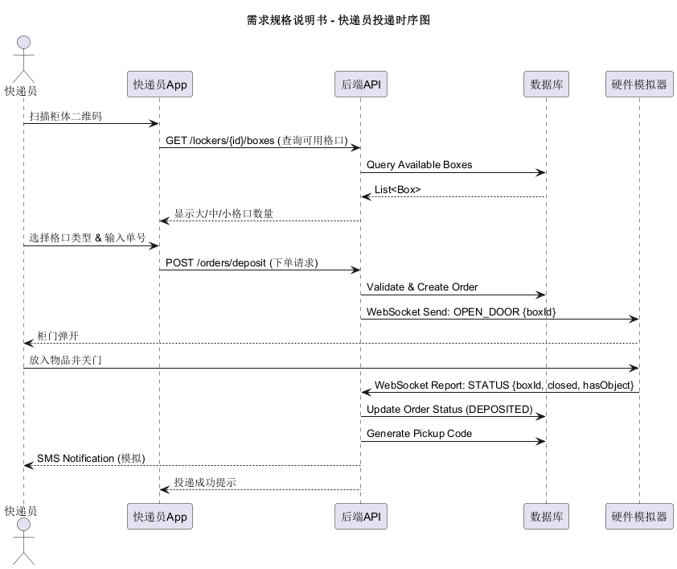
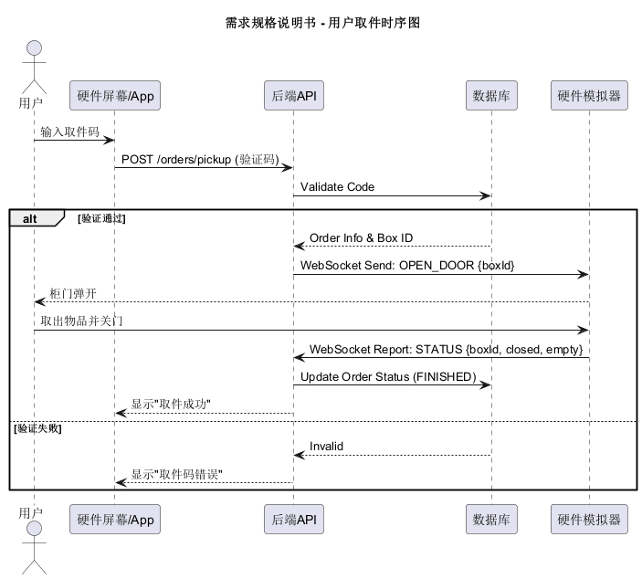
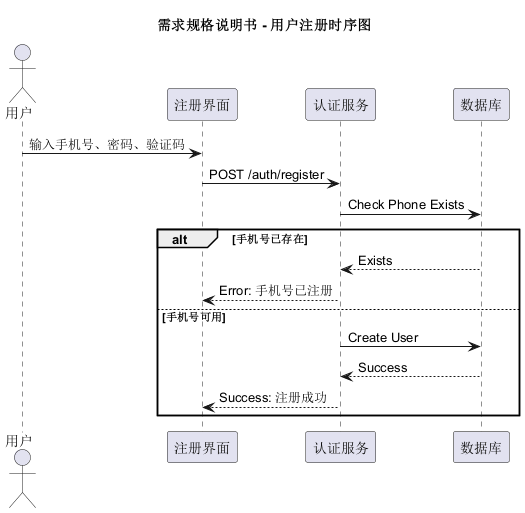
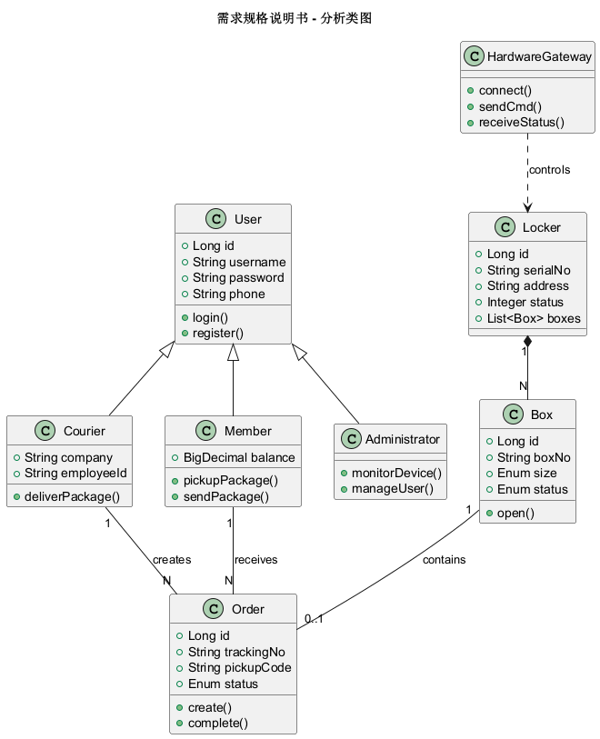
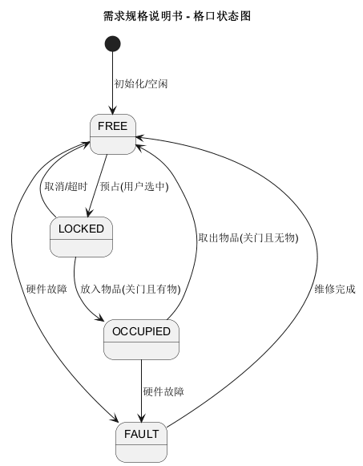
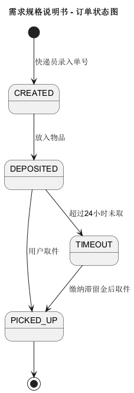

# 需求规格说明书

## 1. 引言

### 1.1 编写目的
本文档旨在完整、准确和详尽地定义“快递柜综合应用系统”（CASExpressLockers）的软件需求，以指导后续的软件设计、编码实现和软件测试等工作。本文档有助于促进项目开发团队成员间的沟通和交流，以达成对软件需求的一致理解。

### 1.2 读者对象
本系统的用户（快递员、普通用户、管理员）、需求分析人员、软件设计人员、软件测试人员等。

### 1.3 软件项目概述
-   **项目名称**: 快递柜综合应用系统 (CASExpressLockers)
-   **开发单位**: 重庆大学软件工程课程设计小组
-   **项目背景**: 随着电商物流的高速发展，为了解决“最后100米”配送难题，智能快递柜成为物流末端的重要基础设施。本项目旨在设计并实现一套包含硬件模拟、移动端应用及Web管理后台的综合系统。

### 1.4 文档概述
本文档主要包含以下章节：
1.  **软件的一般性描述**：描述软件产品与环境的关系、用户特征等。
2.  **软件功能需求描述**：详细描述系统的功能需求，包括用例模型、业务流程、分析类图及状态图。
3.  **软件非功能需求描述**：描述性能、安全、接口等要求。

### 1.5 参考资料
1. 《快递柜综合应用系统》项目任务书
2. 《软件工程：理论与实践》

## 2. 软件的一般性描述

### 2.1 产品前景
该系统旨在解决物流末端配送难题，提供24小时自助存取服务，降低快递员二次派送成本，保护用户隐私。系统运行在移动互联网平台及IoT物联网环境之上。

### 2.2 用户特征
-   **普通用户**：使用App取件、寄件或临时寄存物品，无需专业技能。
-   **快递员**：使用App高效投递快件，需实名认证。
-   **系统管理员**：通过Web后台监控设备状态，管理用户与数据。

### 2.3 运行环境
-   **客户端**：Android/iOS 智能手机。
-   **服务端**：Linux/Windows Server，部署Java Spring Boot应用及MySQL数据库。
-   **硬件终端**：Windows/Linux PC，运行硬件模拟程序（Java Swing/JavaFX）。

## 3. 软件功能需求描述

### 3.1 软件功能概述
CASExpressLockers系统主要服务于三类外部执行者：普通用户、快递员和系统管理员，以及一个硬件终端模拟器。主要功能如下：

1.  **硬件模拟功能**：模拟电源、电表、摄像头、数字键盘、仓门（电磁锁/传感器）、网络模块及显示屏交互。
2.  **快递员端功能**：注册登录、扫码投递（选柜/录单）、历史记录查询。
3.  **普通用户端功能**：扫码/码取件、物品寄存、在线寄件、个人中心管理。
4.  **Web管理平台功能**：
    *   **基础管理**：用户/快递员管理、快递柜/格口管理。
    *   **业务监控**：订单查询、寄存记录、远程开门。
    *   **统计分析**：电量、市场占比、业务趋势、资源使用率可视化。
    *   **系统设置**：全局参数配置（超时时间、功能开关）。

### 3.2 软件需求的用例模型

CASExpressLockers软件系统包含四类主要参与者：快递员（Courier）、普通用户（User）、系统管理员（Administrator）和硬件终端（Hardware）。

### 3.3 软件需求的分析模型

本节详细分析核心用例的业务流程。

#### 1. “Deposit（投递快件）”用例的业务分析
快递员扫描柜体二维码，选择格口并存入快件。

#### 2. “Pickup（用户取件）”用例的业务分析
用户通过输入取件码或扫码取走快件。

#### 3. “Register（用户注册）”用例的业务分析
用户或快递员注册账号。

### 3.4 软件的分析类图

根据用例分析，系统的核心类图如下：

### 3.5 特定对象的状态图

#### 1. 格口 (Box) 状态图
格口的状态流转逻辑。

#### 2. 订单 (Order) 状态图
订单的生命周期管理。

## 4. 非功能需求

### 4.1 接口规范
-   前后端分离，通信基于RESTful API。
-   数据传输采用JSON格式。
-   硬件通信采用WebSocket协议。

### 4.2 数据库
-   使用MySQL 8.0存储业务数据。
-   使用Redis存储热点数据及会话信息。

### 4.3 性能要求
-   App操作响应时间 < 1秒。
-   支持至少100个并发请求。
-   硬件模拟器状态同步延迟 < 500ms。

### 4.4 安全性
-   取件码需加密传输。
-   敏感数据（如手机号）在数据库中脱敏存储。
-   API接口需进行Token身份认证。
