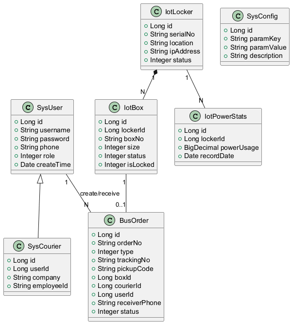
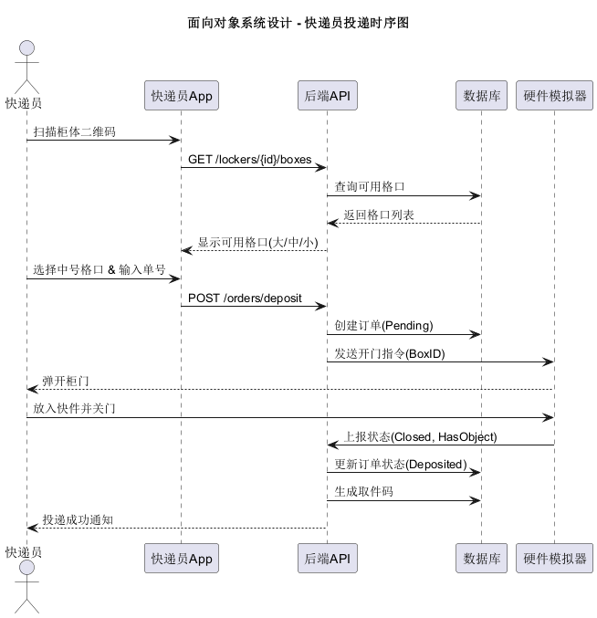
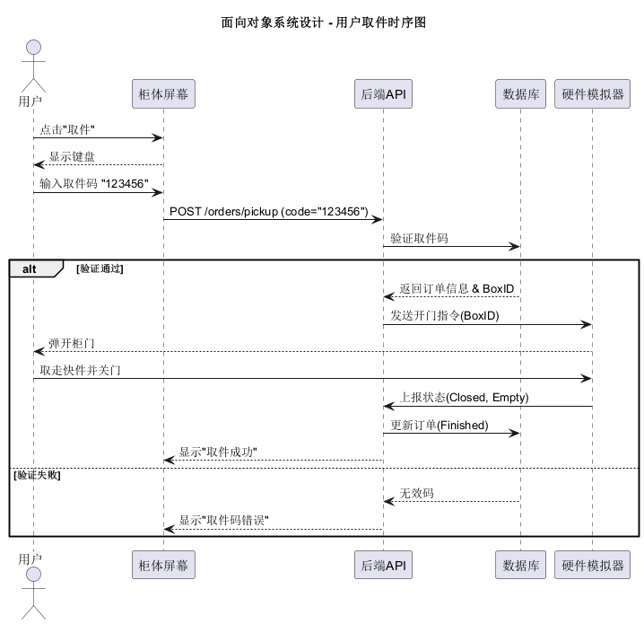

# 面向对象系统设计说明书

## 1. 引言
本文档基于面向对象设计（OOD）原则，对系统进行详细设计，包括类图设计和交互图设计。

## 2. 类图设计 (Class Diagram)

### 2.1 核心实体类 (Entity Classes)
系统主要实体类如下：
-   **SysUser**：用户类，包含 `id`, `username`, `password`, `phone`, `role`。
-   **SysCourier**：快递员扩展信息，包含 `id`, `userId`, `company`, `employeeId`。
-   **IotLocker**：快递柜终端，包含 `id`, `serialNo`, `location`, `ipAddress`, `status`, `List<IotBox> boxes`。
-   **IotBox**：格口，包含 `id`, `lockerId`, `boxNo`, `size`, `status`, `isLocked`。
-   **BusOrder**：订单，包含 `id`, `orderNo`, `type`, `trackingNo`, `pickupCode`, `boxId`, `courierId`, `receiverPhone`, `status`, `createTime`, `finishTime`。
-   **SysConfig**：系统配置，包含 `id`, `paramKey`, `paramValue`, `description`。

### 2.2 控制类 (Control Classes)
-   **AuthController**：处理登录注册。
-   **LockerController**：处理柜体查询、开锁请求。
-   **OrderController**：处理订单创建、状态更新。
-   **HardwareHandler**：处理与硬件模拟器的WebSocket连接。

### 2.3 关系描述
-   `SysUser` 与 `SysCourier` 是1:0..1关系。
-   `IotLocker` 包含多个 `IotBox` (1:N)。
-   `BusOrder` 关联一个 `IotBox` (1:1)。
-   `BusOrder` 关联一个 `SysCourier` (0..1:N)。
-   `SysUser` 关联多个 `BusOrder` (1:N, 作为收件人)。

### 2.4 类图

## 3. 顺序图设计 (Sequence Diagram)

### 3.1 快递员投递时序图

### 3.2 用户取件时序图

## 4. 状态图设计 (State Chart Diagram)

### 4.1 订单状态机
-   **Created**: 订单创建，等待放入。
-   **Deposited**: 物品已放入，等待取件。
-   **Finished**: 用户已取件，订单结束。
-   **Timeout**: 超过24小时未取，超时状态。
-   **Canceled**: 投递取消（如开门后未放入）。

### 4.2 格口状态机
-   **Free**: 空闲，可分配。
-   **Locked**: 已分配但未放入（锁定中）。
-   **Used**: 已存物。
-   **Fault**: 故障（传感器异常或门锁损坏）。

## 5. 设计模式应用
-   **工厂模式 (Factory)**：用于创建不同类型的订单（投递单、寄件单、寄存单）。
-   **观察者模式 (Observer)**：硬件状态变更时通知后端服务。
-   **策略模式 (Strategy)**：不同用户的计费策略（普通用户、会员）。
