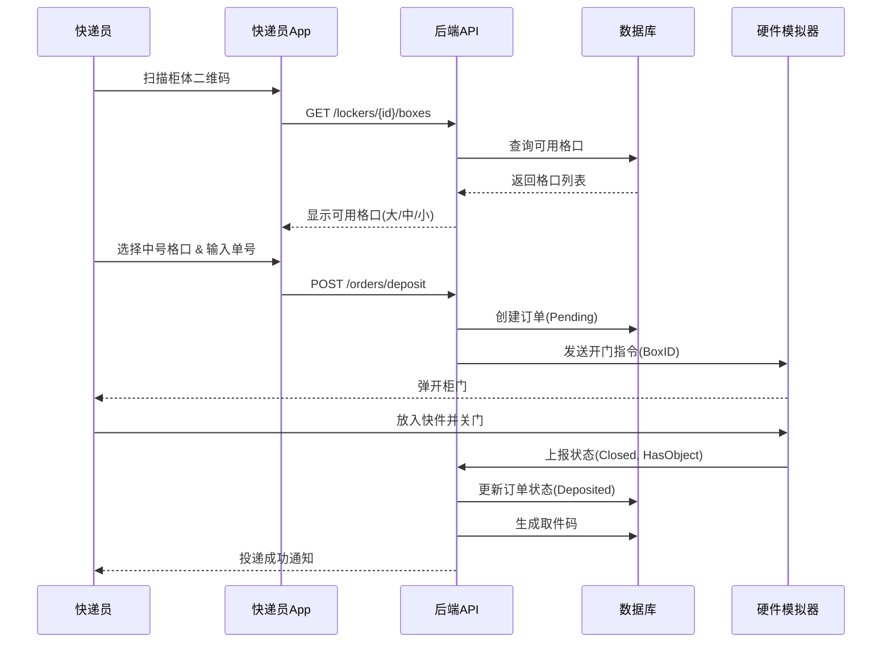
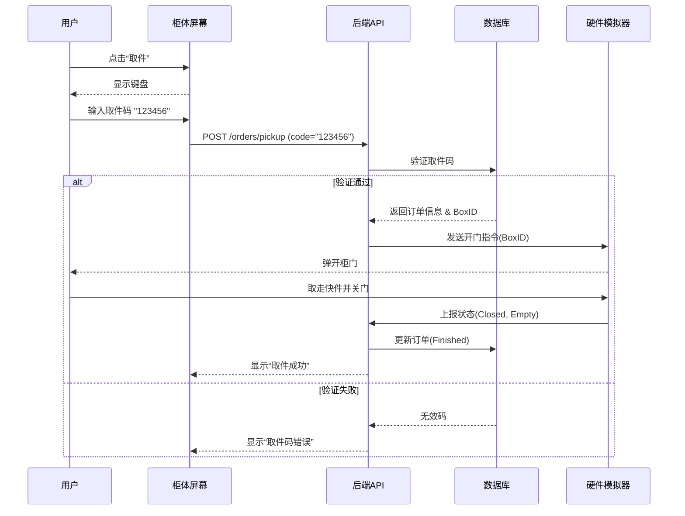

# 面向对象系统设计说明书

## 1. 引言
本文档基于面向对象设计（OOD）原则，对系统进行详细设计，包括类图设计和交互图设计。

## 2. 类图设计 (Class Diagram)

### 2.1 核心实体类 (Entity Classes)
系统主要实体类如下：
-   **User**：用户基类，包含 `userId`, `phone`, `password`。
-   **Courier** (extends User)：快递员，增加 `company`, `employeeId`。
-   **Member** (extends User)：普通用户，增加 `balance`。
-   **Locker**：快递柜终端，包含 `lockerId`, `address`, `ipAddress`, `List<Box> boxes`。
-   **Box**：格口，包含 `boxId`, `size` (S/M/L), `status` (FREE/USED/FAULT), `doorState`, `sensorState`。
-   **Order**：订单，包含 `orderId`, `trackingNum`, `pickupCode`, `status`, `createTime`。

### 2.2 控制类 (Control Classes)
-   **AuthController**：处理登录注册。
-   **LockerController**：处理柜体查询、开锁请求。
-   **OrderController**：处理订单创建、状态更新。
-   **HardwareHandler**：处理与硬件模拟器的WebSocket连接。

### 2.3 关系描述
-   `Locker` 包含多个 `Box` (1:N)。
-   `Courier` 创建多个 `Order` (1:N)。
-   `Order` 关联一个 `Box` (1:1)。
-   `Member` 关联多个 `Order` (1:N, 作为收件人或寄件人)。

## 3. 顺序图设计 (Sequence Diagram)

### 3.1 快递员投递时序图

### 3.2 用户取件时序图

## 4. 状态图设计 (State Chart Diagram)

### 4.1 订单状态机
-   **Created**: 订单创建，等待放入。
-   **Deposited**: 物品已放入，等待取件。
-   **Finished**: 用户已取件，订单结束。
-   **Timeout**: 超过24小时未取，超时状态。
-   **Canceled**: 投递取消（如开门后未放入）。

### 4.2 格口状态机
-   **Free**: 空闲，可分配。
-   **Locked**: 已分配但未放入（锁定中）。
-   **Used**: 已存物。
-   **Fault**: 故障（传感器异常或门锁损坏）。

## 5. 设计模式应用
-   **工厂模式 (Factory)**：用于创建不同类型的订单（投递单、寄件单、寄存单）。
-   **观察者模式 (Observer)**：硬件状态变更时通知后端服务。
-   **策略模式 (Strategy)**：不同用户的计费策略（普通用户、会员）。
