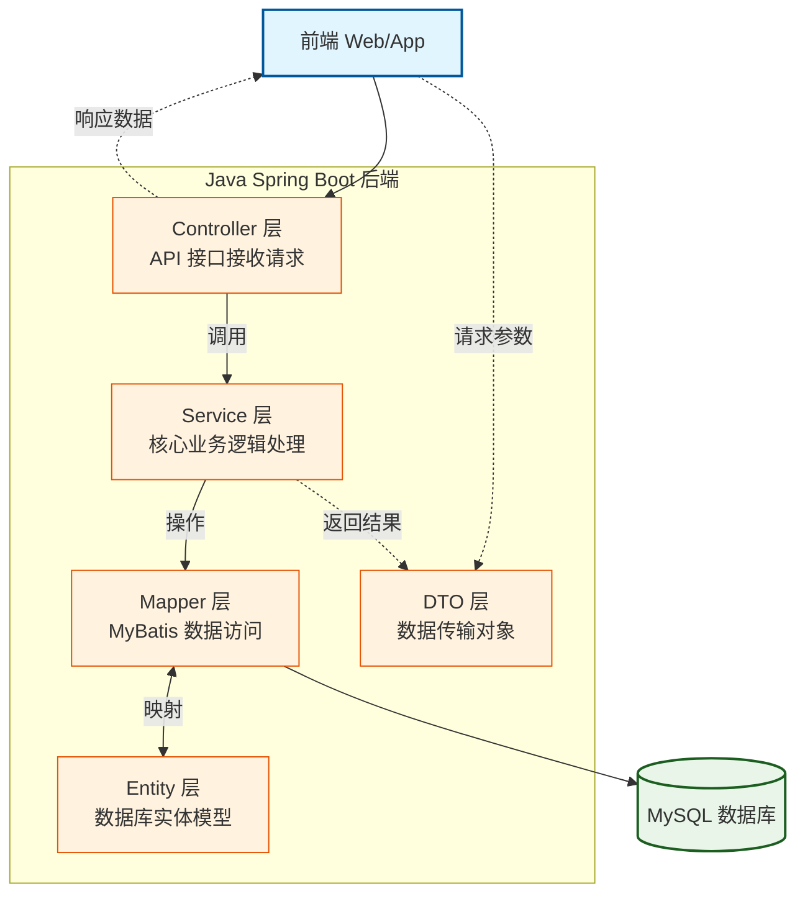

# 项目架构说明书 (Project Architecture)

## 1. 项目概述
快递柜综合应用系统 (CASExpressLockers) 是一个基于物联网概念的物流末端解决方案，旨在提供24小时自助存取服务。系统由 Web 管理后台、后端 API 服务及数据库组成，支持快递员投递、用户取件/寄件/寄存、管理员监控等核心业务。

## 2. 技术栈架构

### 2.1 前端 (Web Management)
位于 `SourceCode/frontend`，基于 Vue 3 生态构建。
*   **核心框架**: Vue 3.4 + Vite 5
*   **UI 组件库**: Element Plus 2.4
*   **状态管理**: Pinia 2.1
*   **路由管理**: Vue Router 4.2
*   **数据可视化**: ECharts 5.4
*   **HTTP 通信**: Axios 1.6
*   **CSS 预处理**: SCSS

### 2.2 后端 (Backend API)
位于 `SourceCode/backend`，基于 Java Spring Boot 构建。
*   **开发语言**: Java 17
*   **核心框架**: Spring Boot 3.2.0
*   **ORM 框架**: MyBatis-Plus 3.5.5
*   **数据库**: MySQL 8.0
*   **工具库**: Lombok, Hutool 5.8
*   **构建工具**: Maven
*   **API 规范**: RESTful API, 统一响应封装 (`Result<T>`)

## 3. 系统分层设计
后端采用经典的分层架构，确保职责分离与可维护性：



*   **Controller (`com.cqu.locker.controller`)**: 接收 HTTP 请求，解析参数，调用 Service，返回 JSON 数据。
*   **Service (`com.cqu.locker.service`)**: 实现核心业务逻辑（如开门验证、订单状态流转），处理事务。
*   **Mapper (`com.cqu.locker.mapper`)**: 继承 MyBatis-Plus `BaseMapper`，提供 CRUD 操作。
*   **Entity (`com.cqu.locker.entity`)**: 对应数据库表结构的 Java POJO 类。

## 4. 核心模块与功能

| 模块 | 包路径 | 核心类 | 功能描述 |
| :--- | :--- | :--- | :--- |
| **认证授权** | `controller.AuthController` | `SysUser` | 用户登录、Token 颁发、用户信息获取。 |
| **设备管理** | `controller.LockerController` | `IotLocker`, `IotBox` | 快递柜增删改查、状态监控；格口管理、远程开门。 |
| **业务订单** | `controller.ExpressController` | `BusOrder` | 投递记录查询、寄存记录查询、订单状态追踪。 |
| **用户管理** | `controller.UserController` | `SysUser`, `SysCourier` | 普通用户管理、快递员资质审核与管理。 |
| **系统配置** | `controller.SystemController` | `SysConfig` | 系统全局参数（如超时时间）的动态配置。 |
| **统计分析** | `controller.StatisticsController` | - | 提供仪表盘数据（在线率、订单量）及图表分析数据。 |

## 5. 数据库设计
数据库名：`express_locker`

### 5.1 基础表
*   `sys_user`: 系统用户（管理员、普通用户、快递员）。
*   `sys_courier`: 快递员扩展信息（所属公司、工号）。
*   `sys_config`: 系统全局配置表。
*   `sys_log`: 系统操作日志。

### 5.2 业务表
*   `iot_locker`: 快递柜设备基础信息。
*   `iot_box`: 格口信息（关联快递柜，包含尺寸、状态）。
*   `bus_order`: 核心订单表（投递、寄件、寄存）。
*   `iot_power_stats`: 设备电量统计表。

## 6. 项目目录结构

```
CQU-Express-Locker-System/
├── Document/               # 设计文档 (v1.0)
│   ├── v1.0/
│   │   ├── output/         # UML 图表导出
│   │   ├── 数据库设计说明书.md
│   │   ├── 需求规格说明书.md
│   │   └── ...
├── SourceCode/             # 源代码
│   ├── backend/            # Java 后端项目
│   │   ├── src/main/java/com/cqu/locker/
│   │   │   ├── config/     # 配置类
│   │   │   ├── controller/ # 控制器
│   │   │   ├── entity/     # 实体类
│   │   │   ├── mapper/     # DAO 接口
│   │   │   ├── service/    # 业务接口及实现
│   │   │   ├── utils/      # 工具类 (Result)
│   │   │   └── LockerApplication.java
│   │   ├── src/main/resources/
│   │   │   └── application.yml # 配置文件
│   │   ├── pom.xml         # Maven 依赖
│   │   └── schema.sql      # 数据库初始化脚本
│   ├── frontend/           # Vue 前端项目
│   │   ├── src/
│   │   │   ├── api/        # API 接口定义
│   │   │   ├── views/      # 页面组件
│   │   │   └── ...
├── Introduction.md         # 项目操作与变更记录
├── ProjectArchitecture.md  # 本文档
└── README.md               # 项目说明
```
